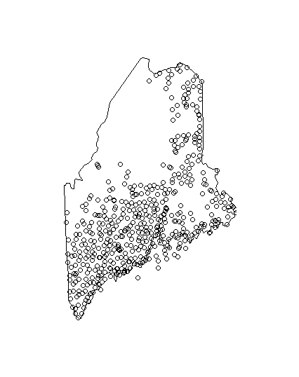

<details>
  <summary> Converting Town Names into Spatial Plots  </summary>
  
  ### Turning Location Names into Spatial Maps using R Classic (with a few helpful packages)

  In this tutorial, I will demonstrate how to create a spatial plot in R. My example will be centered around creating a map of voting proportions by town in the state of Maine, but the code used is applicable to a wide variety of spatial data sets. 

  #### Getting your data
  The first important step is to create a dataset that has Latitude and Longitudinal values. These values are necessary because they tell the plot() function where to put spatial data points. For my data set, I have a list of town names in Maine and corresponding voting data. The original dataset I have can be accessed at the following [link.](/2013_referendum_question_1.csv) It is easiest to work with .csv files if possible.

  As you can see, I have a bunch of town names with vote totals. As we will see later, it is extremely important to have "Maine" at the end of each city name. This is so, when we convert town names to Latitude and Longitude points, we won't get points for similar town names that are not in Maine (for example Amherst, Massachusetts.) 

  Next, lets import the packages we will be using to gather the and plot the spatial data. Run the following code: 

  ``` 
  install.packages("maps")
  install.packages("ggmaps")

  library(maps)
  library(ggmaps)
  ```

  #### Using Google Maps API Key
  The next step is the most difficult task in creating spatial maps. There are many ways to access spatial data sets that have longitude and latitude, but one of the most streamlined ways to do this is to use google maps to create these data for you based on town/city/state/country names. To use google maps to turn my town data into spatial data, I will need to create an API Key and register my account in RStudio. To get the API key, follow the instructions at [the google maps API documentation page.](https://developers.google.com/maps/documentation/embed/get-api-key) Once you have registered for an account and gotten your API Key, all you need to do is write the following code, inserting your API Key within the parentheses. 

  ```
  register_google(your_API_key)
  ```

  What's also important to note is that you have a daily limit of 2500 location queries per day, meaning I can only look up 2500 town names each day. If you wan't unlimited query access you will have to apply for a developer account with google. 

  #### Updating your Data Set with Lon and Lat
  Once you have registered your google account in RStudio, you can begin the process of converting your location names into Latitude and Longitude. The function you will need is `mutate_geocode`. Mutate geocode uses google maps to turn location names (ex: ABBOT Maine) into a specific spatial data point. Mutate geocode requires a dataset and a column to access. In the case of my data set, I will be using the "City" column. 

  ```
  # read in your csv file with location names
  locations <- read.csv("referendums.csv") #referendums.csv is the name of the file on my computer

  # make sure your data set is properly stored as a data frame
  locations <- as.data.frane(locations)

  #convert your locations column into longtiude and latitude
  locations_lat_lon <- mutate_geocode(locations, City) #city is the column with location names I want to access

  #save your file locally to your computer so that you don't have to run mutate geocode again
  write.csv(locations_lat_lon, "locations_updated.csv")

  ```

  Now, hopefully you have been able to store your new file to your computer with columns for city names, latitude, and longitude. If you see your new "locations_updated.csv" file on your computer, and it has correct latitude and longitude points for each location name, lets now download this data into R. 

  ```
  data <- read.csv("locations_updated.csv")
  ```

  #### Create a Map
  From here, we can employ a variety of techniques to plot a base map for our spatial data. In the case of my data, I want to plot a blank map of Maine, which I can do with the `map()` function from the `maps` package. Next, I can plot the location of each town in the data set using the `points()` function and by accessing the `lat` and `lon` columsn of the "locations_updated.csv." 

  ```
  map("state", "Maine")
  points(all$lat ~ all$lon)
  ```

  Running this code should produce the following visual in R studio. 

  Now that I have successfully mapped the locations for each town name, the next step is to represent the proportion of yes votes per town with color. 


  ## Citations
  This tutorial is based on a similar tutorial created by Jesse Sadler on Geocoding with R. The techniques, packages, and functions used are almost exactly the ones detailed in Sadler's blog post. 
  + Sadler, Jesse. “Geocoding with R.” Jesse Sadler Blog, 13 Oct. 2017, www.jessesadler.com/post/geocoding-with-r/.

</details>

